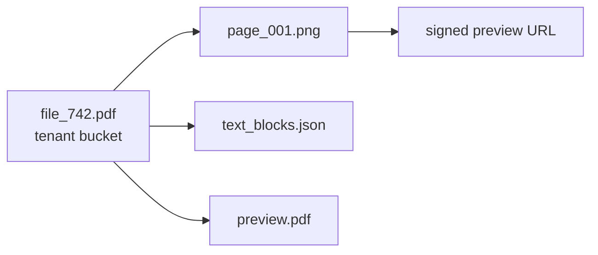

+++
date = 2026-08-31T12:58:04-04:00
title = "File storage is an authorization boundary"
description = "A practical deep dive into designing tenant-scoped object storage for document systems, with canonical object references, signed URLs, derived artifacts, retries, cache safety, and leakage-resistant tests."
slug = ""
authors = []
tags = ["security", "systems", "python", "cloud", "infra"]
categories = []
externalLink = ""
series = []
+++

The dangerous file bug usually does not look like a file bug.

It looks like a harmless convenience parameter:

```json
{
  "file_id": "file_742",
  "object_uri": "gs://northwind-prod/uploads/report.pdf"
}
```

The worker needs bytes. The caller already has a URI. Passing both feels redundant but practical. Then a second internal caller appears, or a retry path gets added, or a cache lands in front of the downloader. One day `file_742` points at one object in the database and `object_uri` points at another object in the request body.

If the worker trusts the request body, it has become a confused deputy. If the byte cache is keyed by `file_id`, it can poison later reads. If derived artifacts inherit the caller-supplied bucket, a page image, thumbnail, or converted workbook can quietly cross a tenant boundary.

This is the claim I keep coming back to: file storage is not plumbing. In a multi-tenant system, file storage is an authorization boundary.

That boundary includes object names, bucket names, signed URLs, derived artifacts, temporary files, caches, lifecycle policies, retry behavior, and every "internal-only" endpoint that can materialize bytes.

## The naive implementation

The first version is usually a shared bucket with user-scoped prefixes:

```text
gs://app-prod-files/
  tenant_a/uploads/file_742.pdf
  tenant_a/derived/file_742/page_001.png
  tenant_b/uploads/file_915.pdf
```

The database stores the path:

```sql
create table files (
  id text primary key,
  tenant_id text not null,
  owner_user_id text not null,
  path text not null,
  original_name text not null,
  created_at timestamptz not null
);
```

The download path is short:

```python
async def download_file(file_id: str, object_uri: str | None) -> bytes:
    if object_uri:
        bucket, blob = parse_gs_uri(object_uri)
    else:
        row = await db.fetch_file(file_id)
        bucket = DEFAULT_BUCKET
        blob = row["path"]

    return await storage.download(bucket, blob)
```

This fails for boring reasons:

| Failure | What breaks |
| --- | --- |
| Caller-supplied URI wins | Object authorization moves out of the storage service |
| Cache key uses only `file_id` | A mismatched URI can poison cached bytes |
| Derived output uses default bucket | Page images or converted files leave the source tenant |
| Prefix parsing is ad hoc | Legacy paths and canonical URIs disagree |
| Signed URL endpoint accepts object path | Anyone who can call it can ask for the wrong object |
| Temp files use predictable names | Concurrent processing can clobber bytes inside one worker |

The prefix model is not always wrong. It is fine for a small internal tool. It is often the simplest thing that works. But once files are user-visible, long-lived, processed asynchronously, and shared across services, prefixes are too weak to be the only boundary.

## Start with canonical object references

The first fix is to stop storing ambiguous paths. Store the complete object reference.

```json
{
  "file_id": "file_742",
  "tenant_id": "tenant_019",
  "storage_uri": "gs://acme-9f3a-prod-files/uploads/file_742.pdf",
  "content_type": "application/pdf",
  "byte_size": 18422091,
  "sha256": "7b5f...",
  "created_by": "user_118"
}
```

Path-only values can still exist during migration. They should be normalized at the edge:

```python
def canonical_storage_uri(value: str, fallback_bucket: str) -> str:
    value = value.strip()
    if value.startswith("gs://"):
        bucket, blob = parse_gs_uri(value)
        return f"gs://{bucket}/{blob.lstrip('/')}"
    return f"gs://{fallback_bucket}/{value.lstrip('/')}"
```

After this boundary, downstream code should not need to guess the bucket. It should receive a canonical storage URI that came from trusted metadata.

That gives the storage service a simple rule:

```python
async def resolve_file_for_read(file_id: str, actor: Actor) -> StoredObject:
    row = await db.fetch_file(file_id)
    if not row:
        raise NotFound()

    if row["tenant_id"] not in actor.tenant_ids:
        raise NotFound()

    bucket, blob = parse_gs_uri(row["storage_uri"])
    return StoredObject(
        file_id=file_id,
        tenant_id=row["tenant_id"],
        bucket=bucket,
        blob=blob,
        version=row["version"],
    )
```

Notice what is missing: no request body URI. The caller can pass `file_id`. The server resolves the object through the dataset the actor can access.

This is the same shape OWASP recommends for avoiding insecure direct object references: do not look up arbitrary objects first and authorize later; scope the lookup to what the current actor can access.

## Tenant buckets are a blast-radius tool

The next question is whether each tenant needs a bucket.

Sometimes no. A single bucket with strict IAM, object names that include tenant ids, and application-level authorization can be enough. Bucket-per-tenant adds operational cost: naming, provisioning, IAM, lifecycle policy, quotas, monitoring, and migrations.

I reach for tenant buckets when at least one of these is true:

- tenants have different retention or residency requirements
- uploads and derived artifacts need a hard blast-radius boundary
- support needs tenant-level inventory and cleanup
- signed URLs are common enough that bucket identity appears in user-visible URLs
- future export/delete workflows need simple tenant-level accounting

The bucket name should be deterministic, valid, and boring:

```python
import hashlib
import re
import unicodedata

def slug(value: str) -> str:
    normalized = unicodedata.normalize("NFKD", value or "")
    ascii_value = normalized.encode("ascii", "ignore").decode("ascii")
    lowered = ascii_value.lower()
    replaced = re.sub(r"[^a-z0-9-]+", "-", lowered)
    return re.sub(r"-{2,}", "-", replaced).strip("-") or "tenant"

def tenant_bucket_name(tenant_id: str, env: str) -> str:
    tenant_hash = hashlib.sha256(slug(tenant_id).encode()).hexdigest()[:16]
    env_slug = slug(env)

    parts = ["app", "tenant", tenant_hash, "files"]
    if env_slug not in {"prod", "production"}:
        env_hash = hashlib.sha256(env_slug.encode()).hexdigest()[:8]
        parts.append(f"e{env_hash}")

    name = "-".join(parts)
    if len(name) > 63:
        raise ValueError("bucket name is too long")
    return name
```

Do not put tenant names, emails, project names, or customer identifiers in bucket names. Cloud Storage bucket names are globally unique and publicly visible, and providers publish strict naming rules. A hash is not a secret, but it avoids advertising business metadata through storage infrastructure.

Provisioning should fail closed:

```python
async def ensure_tenant_bucket(tenant_id: str, env: str) -> str:
    bucket = tenant_bucket_name(tenant_id, env)

    metadata = await storage.get_bucket_metadata(bucket)
    if metadata is None:
        await storage.create_bucket(bucket, location="us-central1")
        metadata = await storage.get_bucket_metadata(bucket)

    if not metadata.uniform_bucket_level_access:
        await storage.enable_uniform_bucket_level_access(bucket)

    if metadata.public_access_prevention not in {"enforced", "inherited"}:
        await storage.enforce_public_access_prevention(bucket)

    await storage.apply_lifecycle_policy(
        bucket,
        delete_after_days=30,
        prefix="tmp/",
    )

    verified = await storage.get_bucket_metadata(bucket)
    if not verified.has_private_controls:
        raise RuntimeError("tenant bucket exists without required controls")

    return bucket
```

The important part is the fallback behavior. If the tenant bucket cannot be created or verified, do not silently write to the shared bucket. That creates exactly the split-brain storage model you were trying to remove.

## Signed URLs are capabilities

A signed URL is not "less auth". It is auth packaged into a URL.

For Cloud Storage, anyone who possesses a signed URL can use it until it expires or the signing key is rotated. Public access prevention does not block signed URLs because the access is granted through the signing account's scoped permissions.

That means the signer is a security-critical service.

The wrong shape:

```python
@router.post("/sign")
async def sign_object(request: SignRequest, actor: Actor) -> str:
    bucket, blob = parse_gs_uri(request.storage_uri)
    return await storage.signed_url(bucket, blob, expires_in=3600)
```

The better shape:

```python
@router.post("/files/{file_id}/signed-url")
async def sign_file(file_id: str, actor: Actor) -> str:
    obj = await resolve_file_for_read(file_id, actor)
    return await storage.signed_url(
        bucket=obj.bucket,
        blob=obj.blob,
        method="GET",
        expires_in=900,
        response_disposition="inline",
    )
```

The signed URL endpoint should take a business id, not an object path. The service resolves that id through the same object-level authorization path used for downloads.

There are a few details worth making explicit:

| Decision | Default I like | Why |
| --- | --- | --- |
| Expiration | 5-15 minutes for previews | Leaked URLs have a small useful window |
| Method | `GET` for reads, separate path for uploads | Capability scope stays obvious |
| Filename | Server-derived content disposition | User input does not shape headers directly |
| Logging | Log `file_id`, not full signed URL | Query string contains the credential |
| Batch signing | Bounded concurrency | Signing can become CPU work at scale |

If you implement V4 signing yourself, test canonicalization heavily. The canonical request includes method, URI, query parameters, signed headers, and payload mode. Small differences in URL escaping or parameter ordering can make a URL invalid or, worse, sign a capability you did not intend.

## Derived artifacts inherit the source boundary

Document systems rarely store just the original upload. They create page images, extracted text, thumbnails, normalized workbooks, converted PDFs, OCR JSON, and evaluation traces.

The source object may be tenant-scoped. The derived objects must not forget that.



The write helper should make inheritance boring:

```python
async def write_derived_artifact(
    source: StoredObject,
    artifact_kind: str,
    bytes_: bytes,
    content_type: str,
) -> str:
    blob = (
        f"derived/{source.tenant_id}/{source.file_id}/"
        f"{artifact_kind}/{sha256(bytes_)[:16]}"
    )
    return await storage.upload(
        bucket=source.bucket,
        blob=blob,
        data=bytes_,
        content_type=content_type,
    )
```

This does two useful things:

1. The artifact lands in the same bucket as the source.
2. The object name is deterministic enough for retries to be idempotent.

Retries matter because file processors often run under queues or durable workflow runtimes. If `page_001.png` upload succeeds and the status write fails, the retry should converge on the same object instead of creating `page_001_retry_7.png` in a different bucket.

The idempotency key should include the boundary:

```text
tenant_id + file_id + source_version + artifact_kind + page_number + render_profile
```

A retry should never have to ask, "Which bucket should I use this time?"

## Caches must include the authority

The most subtle bug in storage code is a cache with the wrong key.

This looks reasonable:

```python
cache_key = f"bytes:{file_id}"
```

It is not enough if any path can materialize bytes using both `file_id` and a caller-provided object reference. The first request can fill the cache with bytes from the wrong object, and the second request can read those bytes under a legitimate id.

The better fix is structural: remove caller-supplied object references from the materialization path. If compatibility requires accepting both for a while, reject mismatches before reading bytes:

```python
async def materialize(file_id: str, requested_uri: str | None, actor: Actor) -> bytes:
    obj = await resolve_file_for_read(file_id, actor)
    canonical = f"gs://{obj.bucket}/{obj.blob}"

    if requested_uri is not None and canonical_storage_uri(requested_uri, "") != canonical:
        raise NotFound()

    cache_key = (
        f"bytes:{obj.tenant_id}:{obj.file_id}:"
        f"{obj.version}:{hash_uri(canonical)}"
    )
    return await cache.get_or_set(cache_key, lambda: storage.download(obj.bucket, obj.blob))
```

Do not return `403` for the mismatch if that reveals object existence across tenants. In many systems, `404` is the safer external response.

## Temporary files are part of the boundary

Native PDF and spreadsheet helpers often want filesystem paths, not byte buffers. The lazy implementation writes to a predictable temp path:

```rust
let path = format!("/tmp/input_{}.pdf", std::process::id());
std::fs::write(&path, pdf_bytes)?;
render_pages(&path)?;
```

That works until the process handles two requests concurrently. Then one invocation overwrites the other's input. The output might be corrupted, or it might contain pages from the wrong tenant.

Use a unique per-invocation temp file, or avoid the filesystem if the library supports in-memory input:

```rust
let mut input = tempfile::NamedTempFile::new()?;
std::io::Write::write_all(&mut input, pdf_bytes)?;
let pages = render_pages(input.path())?;
```

This is not just cleanup hygiene. It is isolation.

The same rule applies to local work directories:

```text
/tmp/work/file_742/        bad if reused across attempts
/tmp/work/run_813/page_01/ good if owned by one invocation
```

The directory name should include a run or attempt id, not only a file id. Idempotent remote object names are good; shared local scratch paths are not.

## Observability should follow object identity

Storage bugs are hard to debug when logs say only "download failed".

Each operation should emit the same small set of fields:

```json
{
  "event": "storage.download",
  "trace_id": "trace_4bf9",
  "tenant_id": "tenant_019",
  "file_id": "file_742",
  "bucket_hash": "bkt_1a92",
  "blob_hash": "obj_8c11",
  "source": "trusted_metadata",
  "attempt": 2,
  "duration_ms": 183,
  "bytes": 18422091,
  "cache": "miss"
}
```

Hash bucket and blob names in ordinary logs. Keep the raw values in a restricted audit trail if operators need them. The goal is to debug routing without turning logs into a second leak surface.

For cross-service processors, propagate trace context through queue messages and workflow payloads. OpenTelemetry's context propagation model exists for exactly this kind of problem: correlate spans, logs, and metrics even when work crosses process and network boundaries.

Metrics I want on the dashboard:

| Metric | Useful labels |
| --- | --- |
| `storage_download_total` | tenant class, source, result |
| `storage_signed_url_total` | method, disposition, result |
| `storage_uri_mismatch_total` | caller, route |
| `derived_artifact_write_total` | artifact kind, inherited bucket |
| `tenant_bucket_provision_total` | result, environment |
| `storage_cache_hit_total` | artifact kind, version |

The best alert is not "GCS returned 403". The better alert is "storage URI mismatches are non-zero" or "derived artifacts are being written to the fallback bucket for tenant-scoped sources."

## Tests that catch real leaks

The tests need two tenants. One tenant will not catch an authorization bug.

```python
async def test_cannot_sign_another_tenants_file(client, tenant_a, tenant_b):
    file_b = await create_file(tenant=tenant_b, storage_uri="gs://b/files/b.pdf")
    actor_a = actor_for(tenant_a)

    response = await client.post(
        f"/files/{file_b.id}/signed-url",
        headers=auth(actor_a),
    )

    assert response.status_code == 404
```

Add mismatch tests around every materialization path:

```python
async def test_requested_uri_must_match_metadata(worker, actor):
    file = await create_file(
        tenant=actor.tenant_id,
        storage_uri="gs://tenant-a/uploads/right.pdf",
    )

    with pytest.raises(NotFound):
        await worker.materialize(
            file_id=file.id,
            requested_uri="gs://tenant-a/uploads/wrong.pdf",
            actor=actor,
        )
```

And add inheritance tests for derived artifacts:

```python
async def test_page_images_inherit_source_bucket(processor, actor):
    source = StoredObject(
        tenant_id="tenant_019",
        file_id="file_742",
        bucket="tenant-019-files",
        blob="uploads/file_742.pdf",
        version=3,
    )

    artifact_uri = await processor.render_page(source, page=1)

    assert artifact_uri.startswith("gs://tenant-019-files/")
```

The minimum useful checklist:

- create two tenants with different buckets
- verify every read/sign/export path denies cross-tenant ids
- verify caller-supplied URIs are rejected or ignored
- verify cache keys include version and canonical storage identity
- verify derived artifacts inherit source bucket
- verify provisioning failure fails closed
- verify signed URL logs do not contain query strings
- verify temp files are unique under concurrent execution

Concurrency tests are worth the trouble here. A storage path can be perfectly correct serially and still leak through shared scratch space or unbounded batch signing under load.

## Tradeoffs

Tenant buckets are not free.

| Tradeoff | Cost |
| --- | --- |
| More buckets | provisioning, quotas, inventory, naming constraints |
| Runtime provisioning | service account needs bucket admin permissions |
| Hashed names | harder manual debugging |
| Fail-closed writes | user-visible errors during provisioning incidents |
| Short signed URL TTLs | more refresh traffic |
| Strict URI matching | migration paths need careful compatibility handling |

The trick is to keep the design boring. Do not build a storage policy engine on day one. Start with one resolver, one canonical URI type, one signing path, one derived artifact helper, and a small set of tests that prove cross-tenant isolation.

The abstractions I actually want are plain:

```python
StoredObject(file_id, tenant_id, bucket, blob, version)
resolve_file_for_read(file_id, actor) -> StoredObject
write_derived_artifact(source, kind, bytes) -> storage_uri
sign_file(file_id, actor) -> signed_url
```

Everything else can wait.

## Conclusion

Object storage looks like a filesystem until the first multi-tenant failure. Then it looks like a distributed authorization system with a filesystem-shaped API.

The design that holds up is not complicated:

- resolve object identity from trusted metadata
- store canonical storage URIs
- treat signed URLs as capabilities
- make derived artifacts inherit the source boundary
- include authority in cache keys
- isolate temporary files per invocation
- trace storage operations with stable business ids
- test with two tenants and hostile object references

The main mistake is letting "internal" mean "trusted." Internal callers still pass data. Workers still retry. Caches still remember. Temporary files still live in shared directories. Signed URLs still grant access to whoever has them.

Treat the storage layer as an authorization boundary early, and a whole class of document-system bugs becomes ordinary code instead of incident response.

## References

- [Google Cloud Storage signed URLs](https://docs.cloud.google.com/storage/docs/access-control/signed-urls)
- [Google Cloud Storage bucket naming and considerations](https://docs.cloud.google.com/storage/docs/buckets)
- [Google Cloud Storage uniform bucket-level access](https://docs.cloud.google.com/storage/docs/uniform-bucket-level-access)
- [Google Cloud Storage public access prevention](https://docs.cloud.google.com/storage/docs/public-access-prevention)
- [Google Cloud Storage Object Lifecycle Management](https://docs.cloud.google.com/storage/docs/lifecycle)
- [OpenTelemetry context propagation](https://opentelemetry.io/docs/concepts/context-propagation/)
- [OWASP Insecure Direct Object Reference Prevention Cheat Sheet](https://cheatsheetseries.owasp.org/cheatsheets/Insecure_Direct_Object_Reference_Prevention_Cheat_Sheet.html)
