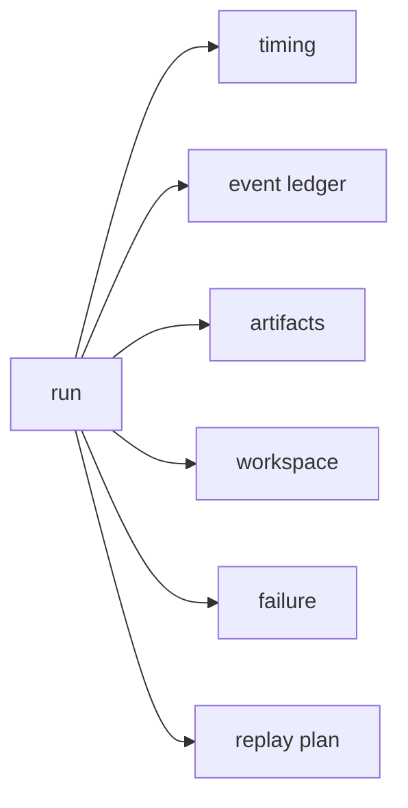

+++
date = 2025-08-14T09:37:12-04:00
title = "Logs are not a debugger"
description = "A practical deep dive into building debuggable run timelines for long-running workflow systems, with trace context, durable artifacts, timing windows, failure dossiers, and operator-facing drilldowns."
slug = ""
authors = []
tags = ["observability", "systems", "python", "typescript", "infra"]
categories = []
externalLink = ""
series = []
+++

A trace that only tells you a job took twelve minutes is not a trace. It is a receipt.

The failure I care about usually looks more annoying than dramatic. A long-running job sits in `running` for nine minutes, writes a partial artifact, emits a few thousand log lines, then exits with a generic timeout. The dashboard says the worker was healthy. The queue says the message was delivered. The log viewer says "processing source 17 of 42" and then nothing useful. The trace has a span named `run_job` with a large duration and several child spans named after internal functions.

Everything is observable. Nothing is debuggable.

The difference matters. Observability tells you the system emitted signals. Debuggability tells you whether an operator can answer the next question without reading code, guessing state, or replaying the job from scratch.

For long-running workflow systems, I have stopped treating logs as the primary debugging interface. Logs are raw material. The product should be a run debugger: a timeline, artifact graph, timing report, failure dossier, and replay path built around the unit the user actually cares about.

That unit is not a request. It is a run.

## The naive implementation

Most systems begin with the familiar stack:

```text
worker logs -> log search
HTTP spans  -> trace backend
metrics     -> dashboard
errors      -> alerting
```

That gets you surprisingly far for request/response services. If an API endpoint regresses from 80 ms to 900 ms, a normal distributed trace works well. You can follow the request across services, find the slow child span, and fix the database query.

Long-running jobs are different:

```text
run_742
  queue wait
  workspace setup
  source downloads
  preprocessing
  external tool calls
  delegated workers
  artifact writes
  validation
  status write-back
```

The job may cross processes, machines, queues, object storage, subprocesses, and external services. Some stages happen before the main worker starts. Some happen after the worker thinks it is done. Some important events are absences: no first stdout chunk, no workspace pointer, no final artifact, no retry heartbeat.

The naive logging plan does not encode that shape.

```python
ctx = {"run_id": run_id}

log("starting", ctx)
logger.info("downloaded inputs")
logger.info("running processor")
logger.info("saved output")
```

Even if every line includes `run_id`, this still leaves the operator doing reconstruction:

- Which stage owned the time?
- Did the worker start late or did preprocessing stall?
- Was the output missing because generation failed or because upload failed?
- Which artifact path was produced before the failure?
- Was the retry processing the same input bundle?
- Which child worker or tool call caused the slowdown?
- Is this run replayable?

Log search can answer some of those with enough patience. A debugger should answer them directly.

## Start with a run model

The first design change is to make the run explicit.

```json
{
  "run_id": "run_742",
  "status": "failed",
  "created_at": "13:03:11Z",
  "started_at": "13:04:02Z",
  "finished_at": "13:16:44Z",
  "bundle": "bundle_129",
  "workspace_id": "ws_742",
  "attempt": 2,
  "trace_id": "trace_4bf92f",
  "manifest_id": "manifest_742"
}
```

This record is not just metadata. It is the join key for the debugger.



The run model needs stable identity for everything an operator may inspect:

- Run: `run_742`, the user-facing unit of work.
- Attempt: `attempt_2`, the retry comparison unit.
- Workspace: `ws_742`, the file tree and replay state.
- Artifact: `artifact_018`, an inspectable output or intermediate.
- Tool call: `tool_991`, the slow-call and failure drilldown.
- Runtime invocation: `invoke_331`, the queue/worker/runtime join key.
- Trace: `trace_id`, the cross-process span linkage.

Without these ids, the UI becomes a pile of timestamps and text snippets. With them, every panel can link to the next one.

## Logs are events, not the interface

I still want logs. I just do not want the operator to read raw logs first.

The ingestion pipeline should classify logs and stdout chunks into an event ledger:

```json
{
  "event_id": "evt_1042",
  "run_id": "run_742",
  "attempt": 2,
  "ts": "13:09:44.381Z",
  "kind": "tool_call_completed",
  "stage": "preprocessing",
  "summary": "Rendered 42 pages",
  "duration_ms": 31844,
  "artifacts": ["artifact_033"],
  "raw_ref": "blob_88:chunk_0019"
}
```

The raw line is still stored. The debugger reads the classified event first.

That gives the UI a sane default:

```text
13:03:11  run created
13:04:02  worker started
13:04:19  workspace ready
13:05:01  downloaded sources
13:09:44  rendered 42 pages
13:14:58  validator started
13:16:44  failed: upload timeout
```

Then the operator can drill into one row and open the raw payload.

The classification does not need to be perfect. It needs to be useful, deterministic, and honest. Unknown events should stay visible as `unknown`, not disappear because the parser could not name them.

## Timing windows beat flat duration

The most useful timing view is not a flame graph. It is a run timeline with windows that match the operator's mental model.

```text
create worker work artifact done
  |------|-----|------|---|
  queue  boot active save
```

A long-running job usually has at least four top-level timing windows:

| Window | Source | Common failures |
| --- | --- | --- |
| Queue wait | run created -> worker claimed | capacity, routing, stuck lease |
| Boot/setup | worker claimed -> first work event | cold start, config, workspace mount |
| Active work | first work event -> final work event | slow tool, bad input, external timeout |
| Write-back | final work event -> finished status | artifact upload, validation, DB update |

The key is to compute these windows from durable evidence, not from wishful phase labels.

```python
def windows(run, events):
    first_work = first(
        events,
        kind_in={"tool"},
    )
    final_work = last(
        events,
        kind_in={"artifact"},
    )

    return [
        win(
            "queue",
            run.created,
            run.started,
        ),
        win(
            "boot",
            run.started,
            ts(first_work),
        ),
        win(
            "active",
            ts(first_work),
            ts(final_work),
        ),
        win(
            "save",
            ts(final_work),
            run.done,
        ),
    ]
```

If a boundary is missing, that is itself a signal.

```json
{
  "window": "boot_setup",
  "start": "13:04:02Z",
  "end": null,
  "status": "open",
  "reason": "no_first_work_event"
}
```

This is how a debugger avoids lying. A dashboard might show a twelve-minute active span. The run debugger can say: "The worker was claimed, but no first work event was ever persisted."

That points to a different class of fixes.

## Artifacts are part of the trace

Traditional tracing focuses on spans. Long-running jobs also need artifact lineage.

An artifact is any durable thing the run creates or consumes:

- downloaded input
- normalized config
- workspace file
- intermediate JSON
- generated report
- rendered page image
- validation result
- final output

The artifact manifest should be written incrementally:

```json
{
  "artifact_id": "artifact_033",
  "run_id": "run_742",
  "kind": "intermediate",
  "path": "output/page_018.png",
  "content_type": "image/png",
  "size_bytes": 184203,
  "producer": "evt_1042",
  "created_at": "13:09:44Z",
  "checksum": "sha256:7ad4..."
}
```

This does two things.

First, it gives operators something concrete to inspect. If the final report is wrong, the debugger can show the exact intermediate file that fed it.

Second, it makes failures after partial progress less mysterious. If a run failed during final upload but produced all intermediate artifacts, replay can begin later in the graph. If the normalized config never existed, the replay starts earlier.

I like drawing the artifact graph beside the event timeline:

```text
source bundle
   |
   v
workspace -> config
   |          |
   v          v
files ----> validation
   |          |
   v          v
output ---> status
```

This graph does not replace spans. It explains what the spans produced.

## Trace context still matters

OpenTelemetry and W3C Trace Context solve an important part of the problem: correlation across process boundaries. The W3C `traceparent` header carries a trace id, parent id, and flags in a standard format. OpenTelemetry spans use span context to propagate trace identity and can attach attributes and events to spans.

Use that machinery. Do not invent a new trace propagation format for HTTP calls and queue messages.

But also recognize its limit: trace context is necessary correlation, not sufficient debugging.

For a run debugger, I want both:

```json
{
  "trace_id": "trace_4bf92f",
  "span_id": "span_00f067",
  "run_id": "run_742",
  "attempt": 2,
  "stage": "artifact_writeback",
  "artifact_id": "artifact_087"
}
```

The trace id lets the observability backend stitch service calls together. The run id lets the product debugger explain the job. The artifact id lets the operator inspect the thing the job touched.

Put all three on the event.

## Failure dossiers are better than error messages

A failed run should open on a dossier, not a log tail.

```json
{
  "run_id": "run_742",
  "failure": "upload_timeout",
  "blocker": "not persisted",
  "evidence": [
    "artifact_087 exists",
    "status stayed running",
    "upload timed out",
    "same bundle on retry"
  ],
  "next_actions": [
    "retry from writeback",
    "inspect artifact_087",
    "compare retry timing"
  ]
}
```

This is not a model-generated summary. It is a deterministic report assembled from run state, timing windows, event ledger, artifacts, and runtime telemetry.

The failure mode classifier can be simple:

```python
def classify_failure(run, data):
    events = data.events
    windows = data.windows
    artifacts = data.artifacts

    no_work = not events.started
    if run.failed and no_work:
        return "pre_work_failure"
    if artifacts.final:
        if not run.persisted:
            return "writeback"
    error = events.error
    limited = "rate" in error
    if limited:
        return "rate_limit"
    active_ms = windows.active.ms
    limit = run.limit_ms
    timed_out = active_ms > limit
    if timed_out:
        return "timeout"
    return "unknown_failure"
```

The important part is not exhaustive classification. The important part is preserving evidence. If the classifier says `unknown_failure`, the dossier should still show which boundaries and artifacts were present.

## Replay is a debugging feature

Retries are usually designed for reliability. Replay should be designed for debugging.

A replayable run has:

- immutable input bundle
- captured configuration
- workspace snapshot or reconstruction recipe
- artifact manifest
- attempt history
- deterministic stage boundaries
- explicit replay start point

The debugger should expose replay as a plan:

```text
Replay run_742
from artifact_writeback

Will reuse:
  input bundle      bundle_129
  workspace         ws_742
  final artifact    artifact_087

Will redo:
  upload final artifact
  write status row
  emit completion event

Will not redo:
  preprocessing
  external extraction
  validation
```

This is safer than a button labeled "retry".

The replay plan also protects against accidental non-determinism. If the input bundle checksum changed, the debugger should block the replay or force a new run. If the config version changed, it should say so. If an intermediate artifact is missing, it should show the earliest valid replay point.

## Build the UI around questions

The debugger UI should not mirror the database schema. It should answer the operator's next question.

I like five surfaces:

| Surface | Question |
| --- | --- |
| Run rail | Which run am I inspecting? |
| Timeline | Where did the time go? |
| Artifact graph | What did the run create or consume? |
| Failure dossier | Why did this fail, and what evidence supports that? |
| Replay plan | What can I safely rerun? |

Each surface should have a raw payload disclosure. That is the escape hatch for engineers. But the default view should be structured.

```text
Run run_742
  status: failed
  total: 12m 33s
  queue: 51s
  boot: 17s
  active: 10m 28s
  write-back: 57s

Primary blocker:
  output produced
  upload timed out

Next debugger action:
  inspect artifact_087
  or replay from writeback
```

This is the difference between "we have logs" and "we can debug the run."

## Sampling and retention

Run debuggers can generate a lot of data. The fix is not to keep everything forever.

Use tiered retention:

| Data | Keep hot | Keep cold |
| --- | --- | --- |
| Run records | long | long |
| Timing windows | long | long |
| Failure dossiers | long | long |
| Event ledger summaries | medium | long |
| Raw logs/stdout | short | medium |
| Intermediate artifacts | short | policy-based |
| Final artifacts | product policy | product policy |

The summaries are cheap and useful. Raw payloads are expensive and sometimes sensitive. Store enough pointers that a debugger can say "raw payload expired" instead of silently showing nothing.

For high-volume runs, sample raw event detail but keep stage boundaries and artifact manifests. A sampled debugger is still useful if it preserves the skeleton of the run.

## Testing the debugger

The debugger needs tests just like the workflow.

Useful test fixtures are small event streams with known shapes:

```python
def test_writeback_dossier():
    run = fake_run("failed")
    events = [
        evt("worker", ts=1),
        evt(
            "artifact_written",
            ts=10,
            artifact="a1",
        ),
        evt("upload", ts=11),
        evt(
            "error",
            ts=71,
            message="timeout",
        ),
    ]
    artifacts = [
        artifact(
            "artifact_1",
            kind="final",
            persisted=False,
        )
    ]

    dossier = build_dossier(
        run,
        events,
        artifacts,
    )

    expected = "upload_timeout"
    failure = dossier.failure
    assert failure == expected
    evidence = dossier.evidence
    aid = "a1"
    assert aid in evidence
    replay = dossier.replay_start
    assert replay == "save"
```

Also test the missing-data paths:

- no stdout
- no first work event
- no final artifact
- failed before worker claim
- artifact exists but manifest row missing
- trace id present but no matching spans
- spans present but no run id

Those are the cases real operators hit at 2 AM.

## Counterintuitive lessons

The best debugger surfaces are not the most detailed ones.

The raw ledger is necessary, but it is rarely the first screen. The first screen should explain the run frame, current blocker, and next action. Detail comes after the operator has a hypothesis.

Another lesson: not every event should be a span. Spans are great for timed operations. State transitions, artifact creation, decision snapshots, and replay boundaries often work better as domain events linked back to spans.

Finally, a "missing" signal deserves a first-class representation. If there is no first stdout chunk, no workspace snapshot, or no status write-back, that absence should appear as a debugger state. Otherwise every pre-work failure looks like a blank page.

## Conclusion

Logs are raw material. Traces are correlation. Metrics are pressure. None of them automatically become a debugger.

For long-running workflow systems, the debugging unit is the run. Build around that unit: stable ids, timing windows, event ledgers, artifact manifests, failure dossiers, and replay plans.

The goal is not to hide raw data. The goal is to stop making humans reconstruct the same story from scratch every time a job fails.

If the operator can answer "where did the time go?", "what artifact existed?", "why did it fail?", and "what can I safely replay?" without opening the codebase, the system is debuggable.

## References

- [OpenTelemetry specification overview](https://opentelemetry.io/docs/reference/specification/overview/) defines traces as spans with attributes and events, and describes span context propagation.
- [OpenTelemetry Tracing API](https://opentelemetry.io/docs/specs/otel/trace/api/) documents span context, span events, attributes, and the relationship to W3C Trace Context.
- [W3C Trace Context](https://www.w3.org/TR/trace-context/) defines the `traceparent` and `tracestate` HTTP headers used to propagate trace identity across systems.
- [Perfetto Trace Processor docs](https://perfetto.dev/docs/analysis/trace-processor) show how trace data can be queried as slices and counters, which is a useful mental model for run timing analysis.
- [Perfetto Track Event docs](https://perfetto.dev/docs/instrumentation/track-events) describe track events, flows, and counters for representing work over time.
