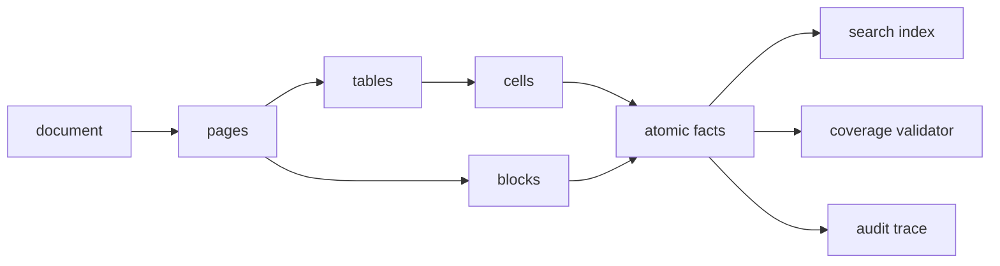
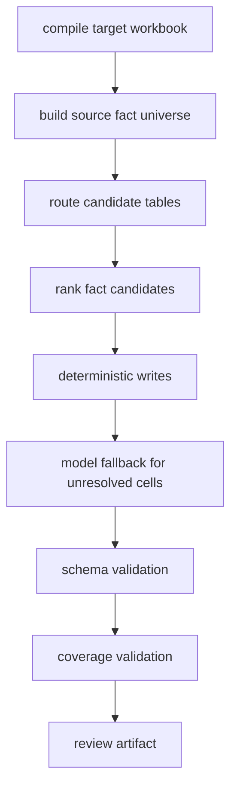

+++
date = 2025-06-20T16:05:24-04:00
title = "RAG is not provenance"
description = "A practical deep dive into building source-grounded table extraction systems where search finds candidates, deterministic validation proves coverage, and every generated value carries auditable evidence."
slug = ""
authors = []
tags = ["AI", "search", "python", "systems", "observability"]
categories = []
externalLink = ""
series = []
+++

The easiest way to make a document extraction system look good in a demo is to hide the evidence.

Ask a model to read a few PDFs, retrieve the top chunks, and fill a spreadsheet. If the answer looks plausible, ship the JSON. The failure usually arrives later, when somebody asks a very simple question:

> Where did this number come from?

That question breaks a surprising number of systems. The value might be correct, but the cited source points at a row label. Or the answer cites a page that contains the right table but not the specific cell. Or the model found the number through search, copied it into the output, and lost the chunk id while formatting the final response. Or worse, the number is a valid value from the document, but it belongs to the wrong period.

This is the uncomfortable lesson: retrieval is not provenance.

Search can find candidates. It cannot prove that a generated value is covered by a source. Provenance needs a stricter contract: stable evidence ids, validation after generation, coverage obligations, and traces that explain why a candidate won.

I like designing these systems as evidence pipelines, not prompt pipelines.

## The naive implementation

The first version usually looks like this:

```python
chunks = search(query="net revenue 2024", limit=8)

answer = model.generate(
    schema=RevenueRow,
    context="\n\n".join(chunk.text for chunk in chunks),
)

save(answer)
```

It is short. It also conflates four different jobs:

| Job | What it should do | What the naive version does |
| --- | --- | --- |
| Retrieval | Find possible supporting material | Returns nearby text |
| Reasoning | Choose the right value | Happens inside an opaque response |
| Provenance | Identify the exact source artifact | Often copied as free text |
| Validation | Reject uncovered output | Usually missing |

The problem is not that vector search or BM25 is bad. The problem is that "chunk appears near query" is a weak claim. It says the chunk is textually related. It does not say the output value is present, belongs to the target field, matches the target period, or is the highest-authority source.

Consider this fictional source table:

```text
Atlas Foods FY2024 Summary

Metric                FY2023      FY2024
Revenue               91.2        104.8
Gross profit          42.1         48.7
Adjusted EBITDA       18.0         22.4
```

Now consider the target workbook:

```text
Sheet: Operating Model

Metric                2024A
Net revenue           [blank]
EBITDA                [blank]
```

A retrieval system may return the row-label chunk:

```json
{
  "chunk_id": "chunk_441",
  "text": "Revenue",
  "page": 12,
  "bbox": [82, 311, 144, 326]
}
```

That chunk helps disambiguate the row. It is not enough to cite the value `104.8`. The value lives in a different cell:

```json
{
  "chunk_id": "chunk_442",
  "text": "104.8",
  "page": 12,
  "bbox": [392, 311, 426, 326],
  "row_path": "Revenue",
  "column_path": "FY2024"
}
```

If the final workbook cites `chunk_441`, the output is not source-grounded even if the number is right. It is label-grounded. That distinction matters when you are reviewing thousands of generated cells.

## Make evidence a first-class data model

The fix starts before any model call. Do not index "chunks" as undifferentiated text. Build an evidence catalog.



The important object is the atomic fact. It is the smallest unit that can safely support an output value.

```json
{
  "fact_id": "fact_018742",
  "origin_type": "table_cell",
  "value": "104.8",
  "normalized_value": "104800000",
  "value_type": "number",
  "row_path": "Revenue",
  "column_path": "FY2024",
  "section_path": "Consolidated summary",
  "source_document": "atlas_foods_fy2024.pdf",
  "page_number": 12,
  "bbox": [392, 311, 426, 326],
  "search_text": "104.8 Revenue FY2024 Consolidated summary Atlas Foods"
}
```

This schema is intentionally boring. It gives every downstream component the same handles:

- `fact_id` for durable identity
- `value` and `normalized_value` for exact comparison
- `row_path`, `column_path`, and `section_path` for semantic alignment
- `page_number` and `bbox` for review
- `search_text` for retrieval

You can still store larger page chunks and table chunks. They are useful for routing and context. They should not be the only citation primitive.

## Retrieve tables before cells

The next mistake is more subtle: retrieving facts one cell at a time.

It feels natural because the target is a cell. But table extraction is usually a block alignment problem. A workbook does not ask for isolated facts; it asks for a slice of a source table under a particular row hierarchy, column hierarchy, unit, period grain, and entity.

I prefer to compile both sides into canonical tables before matching:

```json
{
  "table_id": "src_table_012",
  "origin": "source_pdf",
  "table_type": "financial_summary",
  "entity": "Atlas Foods",
  "period_grain": "fiscal_year",
  "unit": "USD",
  "scale": "millions",
  "title_path": ["FY2024 report", "Consolidated summary"],
  "cells": [
    {
      "cell_id": "src_cell_12_04",
      "row_path": ["Revenue"],
      "column_path": ["FY2024"],
      "value": "104.8",
      "fact_id": "fact_018742"
    }
  ]
}
```

The target workbook gets the same treatment:

```json
{
  "table_id": "target_table_003",
  "origin": "target_workbook",
  "sheet": "Operating Model",
  "table_type": "operating_model",
  "period_grain": "fiscal_year",
  "unit": "USD",
  "scale": "millions",
  "cells": [
    {
      "cell_id": "target_cell_B4",
      "row_path": ["Net revenue"],
      "column_path": ["2024A"],
      "is_fill_target": true
    }
  ]
}
```

Now retrieval has a better job:

```text
template tables
source PDF/XLSX tables
-> canonical table metadata
-> retrieve likely source tables
-> align row and column paths
-> fill cells
-> validate citations and coverage
```

The unit of retrieval becomes the table or block. The unit of citation remains the atomic fact. That distinction is the heart of the design.

## Search should route, not decide

For table retrieval, I usually combine several imperfect recall channels:

| Channel | Good at | Failure mode |
| --- | --- | --- |
| Structured filters | entity, unit, period grain, statement type | bad metadata can hide the right table |
| BM25 / FTS | exact labels, period text, section titles | misses semantic synonyms |
| Vector search | fuzzy table summaries and row/column meanings | retrieves plausible but unauthoritative neighbors |
| Reranker | ordering a small candidate set | too expensive across every fact |
| Model adjudication | final ambiguity explanation | unsafe as the only source of truth |

The key is to use these channels for routing, not proof. Vector search is a recall channel. BM25 is a recall channel. A reranker is a recall channel. None of them proves that the final value is supported by a specific source cell.

One practical fusion method is reciprocal rank fusion:

```python
from collections import defaultdict


def rrf(rankings: dict[str, list[str]], k: int = 60) -> list[tuple[str, float]]:
    scores = defaultdict(float)

    for _channel, ranked_ids in rankings.items():
        for rank, item_id in enumerate(ranked_ids, start=1):
            scores[item_id] += 1.0 / (k + rank)

    return sorted(scores.items(), key=lambda item: item[1], reverse=True)
```

The `k` value is not a correctness threshold. It is a smoothing constant. The output should be treated as "tables worth inspecting next", not "facts we can write".

```python
def retrieve_source_tables(target: CanonicalTable) -> list[TableCandidate]:
    rankings = {
        "filters": rank_by_metadata(target),
        "fts": rank_by_fts(target.search_text),
        "vectors": rank_by_embedding(target.summary_embedding),
    }

    fused_ids = [table_id for table_id, _score in rrf(rankings)]
    short_list = load_tables(fused_ids[:50])
    return rerank_tables(target, short_list)[:8]
```

```python
def retrieve_candidates(target_cell: TargetCell) -> list[FactCandidate]:
    source_tables = retrieve_source_tables(target_cell.parent_table)
    alignments = align_tables(target_cell.parent_table, source_tables)

    facts = facts_for_aligned_paths(
        alignments,
        row_path=target_cell.row_path,
        column_path=target_cell.column_path,
    )

    return rank_facts(target_cell, facts)
```

The route query can be fuzzy because it only decides where to look next. The alignment step should be stricter. It should compare full row paths and full column paths, not just leaf labels.

That matters for nested headers:

```text
Revenue
  Product
  Services

FY2024
  Actual
  Budget
```

If the target asks for `Revenue > Services` and `FY2024 > Actual`, the leaf labels alone are not enough. A source table can contain multiple "Actual" columns and multiple revenue rows. The full paths are the address.

```python
def rank_fact(target: TargetCell, fact: AtomicFact) -> CandidateScore:
    parts = {
        "row": path_similarity(target.row_path, fact.row_path) * 8.0,
        "column": path_similarity(target.column_path, fact.column_path) * 6.0,
        "period": period_match(target.period, fact.column_path) * 10.0,
        "unit": unit_compatible(target.unit, fact.unit) * 4.0,
        "section": token_overlap(target.section, fact.section_path) * 3.0,
        "shape": value_shape_match(target.number_format, fact.value_type) * 6.0,
        "source": source_priority(fact.source_document),
    }

    return CandidateScore(
        fact_id=fact.fact_id,
        score=sum(parts.values()),
        parts=parts,
    )
```

The score parts are not just for tuning. They are an observability surface. When a reviewer asks why a value was chosen, "score 27.4" is not useful. This is useful:

```json
{
  "target_cell": "Operating Model!B4",
  "winner": "fact_018742",
  "score": 27.4,
  "margin": 8.1,
  "parts": {
    "row": 8.0,
    "column": 5.1,
    "period": 10.0,
    "unit": 4.0,
    "section": 2.4,
    "shape": 6.0,
    "source": 1.0
  },
  "runner_up": "fact_019103"
}
```

This turns "the model picked it" into a debuggable ranking problem.

It also avoids the worst scaling shape. Matching every target cell against every candidate fact is the path to `targets * candidates` pain. A table-first pipeline lets you block by table type, entity, period grain, source date, unit, and high-signal tokens before doing expensive semantic comparison.

For larger jobs, I want the hot path to look more like this:

```text
compile target tables once
compile source tables once
bulk insert searchable metadata
batch target embeddings
load source embeddings once
matrix-multiply for top-k recall
run rank workers over bounded candidate sets
emit table_retrieval.json, table_alignment.json, fill_program.json, audit.json
```

The performance lesson is boring but useful: batch what can be batched, cache what has a stable content hash, and keep accelerators busy on embedding work instead of scanning a vector store once per target cell.

## Use ambiguity as a stop signal

The most dangerous extraction bug is not an empty cell. It is a confidently wrong cell.

If two candidates are close, the system should refuse to write. That sounds conservative until you look at the failure mode:

```text
Target: EBITDA, FY2024

Candidate A: 22.4, row="Adjusted EBITDA", column="FY2024"
Candidate B: 21.9, row="EBITDA", column="FY2024"
```

Both may be reasonable depending on the target workbook's convention. A generic prompt cannot reliably infer the accounting policy from proximity alone. The extraction layer should surface the ambiguity.

```python
def choose_candidate(candidates: list[FactCandidate]) -> FactCandidate | None:
    if not candidates:
        return None

    ordered = sorted(candidates, key=lambda c: c.score, reverse=True)
    winner = ordered[0]

    if len(ordered) > 1:
        margin = winner.score - ordered[1].score
        if margin < 3.0:
            return None

    if winner.score < 12.0:
        return None

    return winner
```

The threshold is not magic. It should come from evals. The point is architectural: ambiguity is a valid result, not an exception.

The output can carry that explicitly:

```json
{
  "cell": "Operating Model!B8",
  "status": "unresolved",
  "reason": "ambiguous_candidates",
  "candidates": [
    {"fact_id": "fact_100", "value": "22.4", "label": "Adjusted EBITDA"},
    {"fact_id": "fact_101", "value": "21.9", "label": "EBITDA"}
  ]
}
```

This is much easier to review than a hallucinated citation.

## Coverage obligations catch silent omissions

Most validators check what the system wrote. That is necessary but incomplete. You also need to check what the system ignored.

Before generation, derive coverage obligations from high-signal source regions:

```json
{
  "obligations": [
    {
      "obligation_id": "obl_2024_revenue",
      "region_id": "page_012_table_001",
      "measure_family": "revenue",
      "chunk_ids": ["chunk_442"],
      "fact_ids": ["fact_018742"],
      "high_signal": true
    }
  ]
}
```

After generation, validate that each high-signal obligation was either cited or intentionally marked.

```python
ALLOWED_MARKS = {
    "schema_not_representable",
    "duplicate_lower_authority",
    "context_only",
    "not_applicable",
}

def coverage_errors(obligations, output_rows, marks):
    cited = {
        fact_id
        for row in output_rows
        for fact_id in row.source_fact_ids
    }

    errors = []
    for obligation in obligations:
        if not obligation.high_signal:
            continue

        if set(obligation.fact_ids) & cited:
            continue

        mark = marks.get(obligation.obligation_id)
        if mark in ALLOWED_MARKS:
            continue

        errors.append({
            "code": "unresolved_source_coverage",
            "obligation_id": obligation.obligation_id,
            "region_id": obligation.region_id,
            "measure_family": obligation.measure_family,
        })

    return errors
```

The marks file is important. Not every source fact belongs in the target schema. Sometimes the document contains a metric the workbook does not ask for. Sometimes there are duplicate pages from an appendix. Sometimes a row is context for a calculation but not an output.

The system should allow those decisions, but it should force them to be explicit.

```csv
obligation_id,status,target_table,reason
obl_2024_store_count,schema_not_representable,operating_model,"target has no store count field"
obl_appendix_revenue,duplicate_lower_authority,operating_model,"same value appears in audited summary"
```

This one file changes the review posture. The question stops being "did the model probably use the right sources?" and becomes "which high-signal source facts are unaccounted for?"

## Keep deterministic work outside the model

A common mistake is to ask the model to do extraction, matching, validation, and formatting in one pass:

```text
Read the context, fill the workbook, include citations, and explain any missing values.
```

That prompt is doing too much. The model becomes responsible for tasks where deterministic code is better:

- normalizing numbers
- matching periods
- detecting formula families
- validating required fields
- checking whether a cited fact id exists
- enforcing one citation per atomic value

The architecture should give the model less room to be creative.



The model fallback is still useful. It can reason across messy narrative sections, infer that "net sales" maps to "revenue", or explain why a value is not present. But its output should go through the same gates as deterministic writes.

```json
{
  "value": "104.8",
  "source_fact_ids": ["fact_018742"],
  "confidence": "high",
  "reasoning": "FY2024 revenue value from consolidated summary table"
}
```

Then validate it:

```python
def validate_write(write, fact_index):
    if not write.source_fact_ids:
        return error("missing_source_fact")

    for fact_id in write.source_fact_ids:
        if fact_id not in fact_index:
            return error("unknown_source_fact", fact_id=fact_id)

    if write.value not in {fact_index[f].value for f in write.source_fact_ids}:
        return error("value_not_supported_by_citation")

    return ok()
```

This check is deliberately strict for single-cell numeric writes. For formulas or derived values, the contract can be different: cite every input fact and emit the formula. The point is to make the proof shape explicit.

## Durable execution changes the failure model

Long-running extraction workflows fail in boring ways: provider timeouts, worker restarts, partial uploads, process crashes, duplicate invocations, and retry races.

If the workflow is durable, the validation boundaries become even more important. A replay-safe pipeline should not re-run expensive or non-deterministic work just because a worker died after writing an artifact.

```python
async def solve_workbook(ctx, document_id: str, target_id: str):
    facts = await ctx.run("build-fact-universe", build_fact_universe, document_id)

    candidates = await ctx.run(
        "rank-candidates",
        rank_candidates,
        facts.fact_index_id,
        target_id,
    )

    writes = await deterministic_fill(candidates)

    unresolved = cells_without_writes(target_id, writes)
    fallback_writes = await ctx.run(
        "model-fallback",
        call_model_for_unresolved,
        unresolved,
    )

    return await ctx.run(
        "validate-output",
        validate_output,
        writes + fallback_writes,
        facts.coverage_obligations_id,
    )
```

The exact API varies by runtime, but the principle is stable: non-deterministic operations need durable boundaries. Database reads, provider calls, and model calls should have recorded results so replay does not silently change the answer.

There is a second-order benefit: every durable step becomes an audit boundary. If `rank-candidates` changed between two runs, you can compare the candidate artifacts without re-reading the PDFs.

## Observability should explain wrong answers

Average latency and error rate are not enough for extraction systems. You need product-quality observability: signals that explain why an individual output is wrong.

Useful spans look like this:

```text
solve.exec
  document.count=3
  target.cells=184
  output.writes=171
  output.unresolved=13

facts.build
  source.pages=96
  source.tables=41
  facts.total=6184
  facts.table_cell=4890

retrieval.tables
  target.table=operating_model
  recall.filters=12
  recall.fts=20
  recall.vector=20
  fused.tables=31
  reranked.tables=8

alignment.table
  target.table=operating_model
  source.table=src_table_012
  row.mapped=18
  column.mapped=5
  ambiguous.axes=1

candidate.rank
  target.cell=Operating Model!B4
  winner.fact_id=fact_018742
  winner.score=27.4
  winner.margin=8.1

coverage.validate
  obligations.high_signal=231
  obligations.unresolved=4
```

The span names are less important than the attributes. The trace should let an engineer answer:

- Was the source parsed correctly?
- Did retrieval find the right table?
- Did table alignment preserve the row and column hierarchy?
- Did the correct fact lose ranking?
- Was the output rejected by validation?
- Did coverage fail because the target schema lacked a field?

The trace should also carry artifact links: candidate JSON, coverage obligations, rejected writes, and a compact HTML review page. Without artifacts, traces tell you that a stage failed but not what to do next.

## Evals need failure classes, not just scores

A single accuracy number hides the useful work. I want evals to produce failure classes:

| Failure class | Example | Likely fix |
| --- | --- | --- |
| `missing_route` | Correct table never retrieved | route query or table index |
| `wrong_table` | Similar section from another entity wins | metadata filter / authority ranking |
| `bad_axis_alignment` | right table, wrong row or column path | row/column path parser |
| `over_broad_cell_search` | candidate set includes unrelated tables | block-scoped retrieval |
| `recall_only_vector_hit` | semantic neighbor wins without exact support | stricter validator / reranker scope |
| `wrong_period` | FY2023 chosen for FY2024 | period parser / column scoring |
| `label_citation` | cites row label instead of value cell | citation contract |
| `ambiguous_value` | two candidates within margin | threshold or human review |
| `schema_gap` | source fact has no target field | schema mapping |
| `unsupported_write` | output value not in cited facts | validator / model prompt |

This gives you a roadmap. If most failures are `missing_route`, changing the model is probably a waste of time. If most failures are `unsupported_write`, the model fallback is too unconstrained. If failures are mostly `schema_gap`, the extraction system may be correct and the target schema is the bottleneck.

The eval artifact should include enough data to reproduce the disagreement:

```json
{
  "case_id": "eval_042",
  "target_cell": "Operating Model!B4",
  "expected": "104.8",
  "actual": "91.2",
  "failure_class": "wrong_period",
  "winner": {
    "fact_id": "fact_018701",
    "value": "91.2",
    "column_path": "FY2023"
  },
  "expected_fact": {
    "fact_id": "fact_018742",
    "value": "104.8",
    "column_path": "FY2024"
  }
}
```

For table-first systems, I also want table-level metrics:

| Metric | Why it matters |
| --- | --- |
| target tables compiled | catches workbook parsing failures |
| source tables retrieved | separates retrieval from alignment |
| source tables aligned | detects row/column structure bugs |
| direct fills | measures deterministic coverage |
| formula fills | keeps derivations separate from citations |
| confidence-gated blanks | proves ambiguity handling is active |
| elapsed time by stage | exposes scanning and batching regressions |

That is the difference between measuring and debugging.

## Tradeoffs

This architecture is heavier than a single prompt. It creates more artifacts, more validators, and more concepts. The tradeoff is worth it when outputs are reviewed, reused, or loaded into another system.

The main costs:

| Cost | Why it shows up | Mitigation |
| --- | --- | --- |
| More preprocessing | Facts require structured extraction | cache by document version |
| Stricter validators reject plausible answers | proof is narrower than truth | add explicit derived-value contracts |
| More unresolved cells | ambiguity becomes visible | route to review instead of fabricating certainty |
| Larger traces | artifacts are part of debugging | store compact summaries plus downloadable detail |
| More schema work | coverage needs target semantics | start with high-signal obligations only |

The counterintuitive part is that strictness can make the product feel better. Users trust blank cells with reasons more than filled cells with weak citations. A system that says "I found two plausible EBITDA values and refused to choose" is annoying. A system that silently chooses the wrong one is expensive.

## Practical rules

These are the rules I keep coming back to:

- Search is candidate discovery, not proof.
- Cite atomic facts, not pages or vague chunks.
- Row labels and headers can disambiguate values, but should not be the final citation for numeric cells.
- Every generated value should either cite source facts, declare itself derived, or stay unresolved.
- Coverage validation should check ignored high-signal sources, not just malformed outputs.
- Ambiguity should stop writes.
- Evals should classify failures by system boundary.
- Traces should carry artifacts, not just timings.

None of this removes the need for good models. It just stops asking them to be the database, search engine, validator, and auditor at the same time.

## References

- [Restate durable steps](https://docs.restate.dev/develop/python/journaling-results/) for the idea of recording non-deterministic operations such as HTTP calls or database responses during durable execution.
- [Reciprocal Rank Fusion](https://research.google/pubs/reciprocal-rank-fusion-outperforms-condorcet-and-individual-rank-learning-methods/) for a simple rank-fusion method that works well when multiple retrieval systems produce different orderings.
- [SQLite FTS5](https://www.sqlite.org/fts5.html) for full-text indexing and the built-in `bm25()` ranking function used in many lightweight retrieval systems.
- [Sentence Transformers semantic search](https://www.sbert.net/docs/package_reference/util.html#sentence_transformers.util.semantic_search) for the common embedding-search pattern of comparing query embeddings against corpus embeddings with bounded `top_k` results.
- [Python `concurrent.futures`](https://docs.python.org/3/library/concurrent.futures.html) for the standard thread and process pool interface used to separate I/O-heavy and CPU-heavy work.
- [OpenTelemetry context propagation](https://opentelemetry.io/docs/concepts/context-propagation/) for correlating traces across process and service boundaries.
- [JSON Schema object validation](https://json-schema.org/understanding-json-schema/reference/object) for the distinction between object properties and required fields in structured validation.
- [Microsoft Open XML shared string table](https://learn.microsoft.com/en-us/office/open-xml/spreadsheet/working-with-the-shared-string-table) for how spreadsheet data can reference shared workbook-level string storage rather than inline text.

## Conclusion

A source-grounded extraction system is not a model call with citations sprinkled on top. It is a pipeline that preserves evidence identity from parsing through retrieval, generation, validation, and review.

RAG helps find the room where the answer might live. Provenance proves which object in that room supports the value you wrote.
