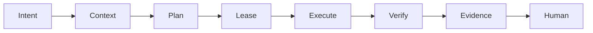

+++
date = 2026-06-06T21:22:16-04:00
title = "The harness is the product"
description = "Context engineering, browser agents, MCP, and software factories are all pointing at the same thing: the real product boundary for AI agents is the harness that controls context, tools, execution, verification, and cost."
slug = ""
authors = []
tags = ["AI", "agents", "systems", "architecture", "engineering"]
categories = []
externalLink = ""
series = []
+++

The current Tech Twitter loop is easy to summarize:

```text
2023: prompts
2024: agents
2025: context engineering
2026:
  harness engineering
  browser agents
  software factories
```

The naming is noisy, but the underlying shift is real. We are running out of value in arguing about the smartest prompt. The useful work is moving into the system around the model: what it can see, what it can do, where it runs, how it is interrupted, how it proves progress, how it spends money, and how a human takes over without reconstructing a crime scene from chat history.

The harness is the product.

Not the chat box. Not the model dropdown. Not the tool list. The harness.

I mean the runtime substrate that turns a probabilistic model call into a bounded software operation. If the agent is allowed to edit a repo, drive a browser, call MCP tools, query a warehouse, triage CI, or open a pull request, the harness is the part that decides whether this is engineering or just expensive autocomplete with side effects.

## The demo architecture lies

Most agent products start as a loop:

```python
while not done:
    msg = model(context, tools)
    result = run_tool(msg)
    context.append(result)
```

That loop proves the product idea. It also hides every production problem.

| Demo assumption | Production reality |
| --- | --- |
| Context is a prompt | Context is a compiled artifact with sources, expiry, and budget |
| Tools are functions | Tools are authority grants with audit and revocation |
| The browser is a UI | The browser is an unreliable distributed system with pixels |
| A trace is debugging | A trace is the system of record for accountability |
| Cost is a bill | Cost is a correctness signal and routing input |
| Human review is a button | Human review is a state transition with ownership |

The moment an agent can act outside the text window, the loop needs a control plane. The control plane does not need to be clever. It needs to be explicit.



Each box has a concrete job. If one of them is missing, the missing part gets smuggled into a prompt.

That is how systems become flaky.

## Context is compiled, not collected

"Context engineering" became popular because models got good enough that bad context became the bottleneck. That is correct, but incomplete.

The common mistake is treating context as "more stuff in the window." A better mental model is compilation. The harness compiles a context pack from available sources, records why each source was included, and makes the pack small enough to be replayed, cached, and inspected.

```json
{
  "context_pack_id": "ctx_7c91",
  "task_id": "task_184",
  "base_rev": "git:6b4e2a1",
  "budget": {
    "max_prompt_bytes": 180000,
    "max_tool_schemas": 12,
    "max_excerpt_bytes": 64000
  },
  "sources": [
    {
      "kind": "file",
      "uri": "search/index.rs",
      "reason": "symbol",
      "sha256": "sha256:..."
    },
    {
      "kind": "trace",
      "uri": "ci/fail.log",
      "reason": "failure",
      "sha256": "sha256:..."
    },
    {
      "kind": "tool_schema",
      "uri": "github/pr.read",
      "reason": "inspect PR",
      "sha256": "sha256:..."
    }
  ],
  "excluded": [
    {
      "uri": "public/build.log",
      "reason": "summarized"
    }
  ]
}
```

That object gives you handles:

- Why did the model see this file?
- Did it see stale data?
- Which sources were omitted?
- What changed between the first run and the retry?
- Did a tool schema consume more budget than the task itself?

Without a context pack, the team debugs vibes. With a context pack, the team debugs inputs.

This is the part of the Uber software-factory post that matters most to me. The interesting claim is not just that agent usage is high. It is that they decomposed the cost equation, measured real work, routed tools through controlled surfaces, and invested in context graphs and session analysis. That is a harness story, not a chatbot story.

## Tool schemas are a tax

MCP and similar tool protocols are useful because they standardize capability exposure. They are also dangerous because a naive product loads every schema into every run.

The model does not need the entire company tool catalog to fix one failing test. It needs a narrow capability slice.

```yaml
tool_budget:
  max_loaded_tools: 8
  max_schema_bytes: 24000
  default_authority: read
  write_requires: approval
  discovery: search_then_load
```

The harness should treat tool selection like dependency loading:

```python
def load_tools(task, cat):
    hits = cat.search(
        task.intent,
        limit=20,
    )
    ranked = rank_by_scope(
        hits,
        task.caps,
    )

    loaded = []
    for tool in ranked:
        size = schema_bytes(
            loaded + [tool],
        )
        if size > task.budget:
            continue
        if not allowed(tool):
            continue
        loaded.append(tool)

    return loaded
```

This does two things.

First, it keeps the model from paying attention to tools it should never call. Second, it gives the platform a lever for cost and safety. A 60-tool session is not "powerful" if 52 tools are irrelevant. It is just a larger search problem with a larger blast radius.

The staff-level move is to make tool loading observable:

| Metric | Why it matters |
| --- | --- |
| Loaded schema bytes | Measures prompt tax before work starts |
| Tool search miss rate | Shows when discovery is hiding the right capability |
| Unused loaded tools | Finds bloated tool packs |
| Write-tool requests denied | Identifies bad task routing or missing approvals |
| Tool-call retries | Separates flaky integrations from model mistakes |

If the harness cannot explain why a tool was available, the tool probably should not have been available.

## Authority should be leased

Agents should not receive permanent authority. They should receive leases.

```sql
create table authority_lease (
  id text primary key,
  task_id text not null,
  principal text not null,
  capability text not null,
  resource text not null,
  mode text not null,
  check (mode in (
    'read',
    'propose',
    'write'
  )),
  expires_at timestamptz,
  approved_by text,
  approval_artifact text,
  created_at timestamptz
);
```

Examples:

| Task | Lease |
| --- | --- |
| Inspect failing CI | read logs for one run id |
| Draft a PR | propose changes in one worktree |
| Update an issue | write one comment after approval |
| Browser checkout flow | drive one origin with network capture |
| Warehouse analysis | run read-only queries with row limits |

This is not bureaucracy. It is how the harness prevents capability drift. Long-running agents accumulate state, plans change, and tool catalogs evolve. A lease makes authority time-bounded and resource-bounded.

It also makes human review precise. Instead of "approve the agent," the UI can ask:

```text
Allow write comment?
Resource: gh://org/repo/pr/418
Lease: 10 minutes
Body: reviewed/comment.md
Evidence:
  ci-readback.json
  review-summary.json
```

That is an approval a staff engineer can reason about.

## Browser agents need checkpoints, not confidence

The browser-agent trend is correct for a simple reason: a lot of real work still only exists behind web UIs. APIs cover pieces of the workflow. The complete job often crosses forms, documents, dashboards, modals, downloads, email links, and weird enterprise state.

The trap is pretending the browser is just another tool.

A browser is a hostile execution environment:

- selectors drift
- hidden state matters
- network requests race
- pixels can be the only truth
- auth expires mid-run
- modals steal focus
- downloads are asynchronous
- the page can say success while the backend failed

The harness needs checkpoints:

```json
{
  "id": "br_019",
  "origin": "example.com",
  "step": "submit_invoice_form",
  "pre": {
    "url": "/invoices/new",
    "dom_sha256": "sha256:...",
    "shot_sha256": "sha256:..."
  },
  "action": {
    "kind": "click",
    "css": "button.submit",
    "lease": "lease_invoice"
  },
  "post": {
    "url": "/invoices/INV-1042",
    "network_2xx": 14,
    "network_4xx": 0,
    "assertions": [
      "invoice id visible",
      "download link visible",
      "status == draft"
    ]
  }
}
```

For browser work, screenshots are not vanity artifacts. They are evidence. Network logs are not debugging clutter. They are the difference between "the button was clicked" and "the operation succeeded."

The harness should prefer semantic assertions where possible and pixel evidence where necessary. A browser agent without checkpoints is just a faster way to create unreproducible support tickets.

## Execution capsules beat ambient shells

The agent should not inherit a random shell and a pile of hidden environment state. It should run inside an execution capsule.

```yaml
execution_capsule:
  id: exec_31a8
  task_id: task_184
  filesystem:
    root: work/task_184
    writable:
      - work/task_184/repo
      - work/task_184/artifacts
    read_only:
      - cache/dependencies
  network:
    mode: allowlist
    hosts:
      - github.com
      - registry.npmjs.org
  process:
    timeout_seconds: 1800
    max_parallel: 8
    kill_on_exit: true
  outputs:
    capture_stdout: true
    capture_stderr: true
    capture_git_diff: true
    capture_artifacts: true
```

This is the same lesson as containers, CI, and workflow engines: ambient state is where reproducibility goes to die.

The capsule gives the harness enough structure to answer:

- Which files could the agent write?
- Which network calls were allowed?
- Which processes were still alive at exit?
- What diff did the run produce?
- Which artifact hashes belong to this attempt?

You do not need a research-grade sandbox to get value here. A clean worktree, environment allowlist, process cleanup, and captured outputs are already a big improvement over "let the agent run commands."

## Verification is a separate phase

The model should not grade its own work. It can propose a verification plan. The harness should run it.

```python
def verify(task, patch):
    gates = [
        clean_worktree_before(),
        apply_patch(patch),
        run("fmt", task.fmt),
        run("lint", task.lint),
        run("test", task.test),
        run("diff", task.diff),
        scope_check(task.scope),
        clean_process_table(),
    ]

    return manifest(gates)
```

For bug fixes, add a bite test:

```text
green: patch + test passes
red: remove fix, test fails
green: restore fix, test passes
```

For browser agents, add a replay probe:

```text
same input fixture
same browser profile class
same semantic assertions
fresh session
```

For data agents, add conservation checks:

```text
read >= emitted + blocked
emitted rows have source ids
blocked rows have reasons
no write before approval
```

Verification has to be dumb and repeatable. If the agent says "looks good," that is a note. If the harness records exit codes, screenshots, diffs, and invariant results, that is evidence.

## Failure attribution is the missing UI

Most agent UIs collapse every failure into "the model failed." That is lazy instrumentation.

A useful harness classifies failures before asking a human to intervene:

- `bad_context`: relevant file omitted; owned by the context compiler
- `bad_tool_surface`: correct tool unavailable; owned by the tool catalog
- `integration_flake`: browser action raced the backend; owned by execution
- `bad_plan`: impossible sequence; owned by the planner
- `bad_patch`: tests fail after implementation; owned by the patch worker
- `weak_verifier`: tests pass after removing the fix; owned by verification
- `policy_block`: approval or disclosure path missing; owned by publishing
- `cost_runaway`: repeated calls with no state progress; owned by routing

This table should exist in the product. Not as a wiki page. As a required field on failed runs.

```json
{
  "run_id": "run_8cc4",
  "task_id": "task_184",
  "state": "failed",
  "class": "bad_context",
  "evidence": [
    "missing tokenizer.rs",
    "trace names normalize",
    "retry with file passed"
  ],
  "next": "fix symbol expansion"
}
```

This is where harness engineering compounds. Every failure should either become a better compiler rule, a tighter tool policy, a new verifier, or a clearer human escalation. If failures only become longer prompts, the system is not learning.

## Cost is a systems signal

The Uber post made this explicit: at scale, agent cost is not a finance-only concern. It decomposes into adoption, sessions, turns, requests, context size, output size, model price, cache behavior, and tool overhead.

That is exactly how I would model it:

```text
cost_per_success =
  attempts_per_success
  * turns_per_attempt
  * requests_per_turn
  * context_bytes_per_request
  * model_price_per_byte
```

The point is not the exact units. The point is that each term has a different owner.

| Term | Engineering lever |
| --- | --- |
| Attempts per success | better candidate selection and verifiers |
| Turns per attempt | better plans and phase boundaries |
| Requests per turn | batching and deterministic subprocess loops |
| Context bytes | compiled context packs and tool search |
| Model price | workload-specific routing |
| Cache misses | stable prefixes and session TTL policy |

Cost regressions often reveal correctness regressions. An agent that spends 20 minutes searching for a table probably lacked a graph edge. A browser agent that retries the same click five times probably lacks a postcondition. A coding agent that spawns reviewers for a two-line patch probably lacks a scope heuristic.

Spend is telemetry. Treat it that way.

## The product surface should expose the harness

The UI should not show only chat. It should show the harness state.

```text
Task: fix search regression

Context
  pack: ctx_7c91
  files: 6
  tool schemas: 4
  excluded: 3 summaries

Authority
  repo write: propose only
  comment: approval required
  browser origin: none

Execution
  capsule: exec_31a8
  worktree: clean
  network: allowlist
  live cost: $0.42

Verification
  format: pass
  lint: pass
  focused tests: pass
  bite test: pass
  scope budget: pass
```

That screen is more useful than a transcript. The chat pane can sit beside it, but the operation should not live inside the chat pane.

When a human intervenes, they should mutate state:

```text
approve lease
reject plan
add context source
lower scope budget
rerun verifier
publish reviewed artifact
```

Every one of those actions is auditable. Every one gives the agent a better world to operate in.

## What I would build first

If I were adding this to an existing engineering org, I would not start with a grand platform. I would start with one managed workflow and one ledger.

Pick a narrow task class:

```text
failing CI triage
dependency update PRs
docs link repair
simple bug reproduction
browser-based QA check
```

Then implement the smallest harness that enforces the important boundaries:

```text
task row
context manifest
authority lease
execution capsule
gate runner
evidence manifest
human approval
live readback
```

Avoid building a generic agent platform first. Generic platforms attract generic failure modes. A narrow workflow gives you real traces, real cost curves, and real reasons to improve the harness.

The first version can be embarrassingly simple:

```sql
create table agent_task (
  id text primary key,
  kind text not null,
  state text not null,
  context jsonb not null,
  authority jsonb not null,
  evidence_manifest jsonb,
  failure_class text,
  created_at timestamptz,
  updated_at timestamptz
);
```

That table plus disciplined artifacts will beat a beautiful chat UI with no state model.

## The real trend

The interesting part of the current X discourse is not the labels. "Context engineering", "harness engineering", "browser agents", "AI engineering skills", and "software factory" are all pointing at the same architecture:

```text
models are becoming workers
the harness becomes the backend
engineers design the envelope
```

That is the part worth paying attention to.

Models will keep improving. Context windows will keep growing. Browser agents will get better at clicking around. MCP servers will keep multiplying. None of that removes the need for a runtime that can answer:

- What did the agent see?
- What authority did it have?
- What did it change?
- How was it verified?
- What did it cost?
- Who approved the irreversible step?
- Can we replay or explain it tomorrow?

If your product cannot answer those questions, it does not have an agent architecture yet. It has an agent-shaped demo.

The harness is the product because the harness is where engineering judgment survives contact with autonomy.

## References

- [Andrew Ng on the AI Engineering Skills Map](https://x.com/AndrewYNg/status/2088302050706686198)
- [Browserbase on browser agents and computer use](https://x.com/browserbase/status/2089437678181974064)
- [Uber Engineering on the Software Factory](https://x.com/UberEng/status/2093444169037762840)
- [Running a Software Factory Efficiently at Uber Scale](https://www.uber.com/br/en/blog/efficient-software-factory/)
- [Harness engineering for coding agent users](https://martinfowler.com/articles/harness-engineering.html)
- [Model Context Protocol 2026-07-28 specification](https://modelcontextprotocol.io/specification/2026-07-28)
- [OpenAI Agents SDK tracing documentation](https://openai.github.io/openai-agents-python/tracing/)
